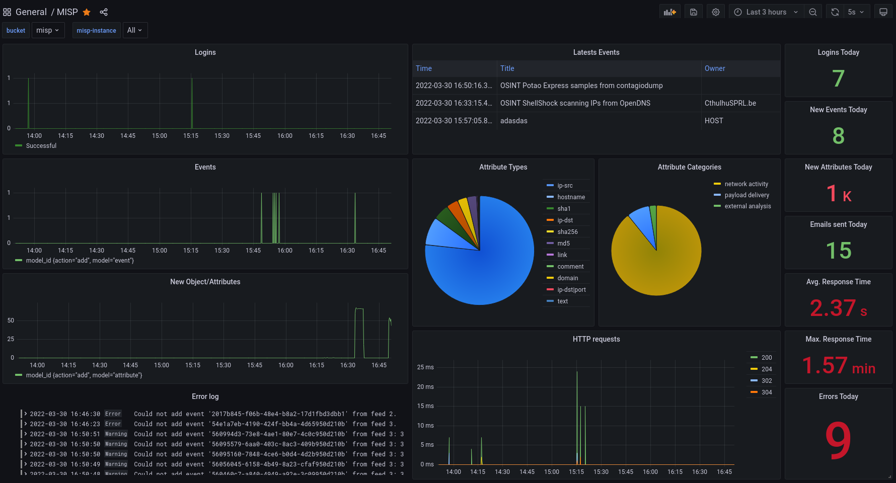

# misp-metrics


## Infrastructure
- **InfluxDB 2.x**: Time series database for storing MISP metrics 
    - URL: http://localhost:8086
    - default user: admin
    - default password: passwordpasswordpassword
- **Grafana**: For the UI and dashboards
    - URL: http://localhost:3000
    - default user: admin
    - default password: passwordpasswordpassword
- **[push_zmq_to_influxdb.py](./src/push_zmq_to_influxdb.py)**: Subscribes to the MISP ZMQ stream and pushes data to InfluxDB
- **Telegraf**: Agent installed in the MISP instance for pushing logs to InfluxDB

## Installation

### Using containers
Using docker is the easiest way to do it and comes pre-configured with the dashboard and InfluxDB datasource.

```
$ cd docker
$ docker-compose up -d
```

> **NOTE**: For production usage change the default passwords.

### Pushing MISP metrics
After InfluxDB and Grafana are up and running, adjust [.env](./src/.env) file to your environment, and run the ZMQ subscriber script:

```
$ cd src/
$ pip install -r requirements.txt
$ python3 src/push_zmq_to_influxdb.py 
[INFO] [2022-03-31 17:32:51,602] - Subscribed to ZMQ
[INFO] [2022-03-31 17:32:56,945] - Received message from topic: misp_json_self
[INFO] [2022-03-31 17:32:56,945] - ZMQ status pushed to InfluxDB
...
``` 

> **NOTE:** This script must be running all times to feed InfluxDB with your MISP activity.

### Pushing MISP logs
[Telegraf](https://www.influxdata.com/time-series-platform/telegraf/) agent is used to parse MISP logs and push them to InfluxDB, to install it follow this guide:
* https://docs.influxdata.com/telegraf/v1.21/introduction/installation/

Run the agent:
```
$ telegraf --config telegraf/telegraf.conf
```

> **NOTE:** For the HTTP response time panels you need to extend the default Apache combined log format with the _`%D`_ option, your Apache log configuration as follow:
> 
> `LogFormat "%h %l %u %t \"%r\" %>s %O \"%{Referer}i\" \"%{User-Agent}i\" %D" combined`
> * More info: https://httpd.apache.org/docs/current/mod/mod_log_config.html

### MISP
Go to your [ZeroMQ](https://zeromq.org/) plugin settings in MISP and set the following values:
```
  'ZeroMQ_enable' => true,
  'ZeroMQ_host' => '127.0.0.1',
  'ZeroMQ_port' => 50000,
  'ZeroMQ_redis_host' => 'localhost',
  'ZeroMQ_redis_port' => 6379,
  'ZeroMQ_redis_database' => '1',
  'ZeroMQ_redis_namespace' => 'mispq',
  'ZeroMQ_event_notifications_enable' => true,
  'ZeroMQ_object_notifications_enable' => true,
  'ZeroMQ_object_reference_notifications_enable' => true,
  'ZeroMQ_attribute_notifications_enable' => true,
  'ZeroMQ_sighting_notifications_enable' => true,
  'ZeroMQ_user_notifications_enable' => true,
  'ZeroMQ_organisation_notifications_enable' => true,
  'ZeroMQ_tag_notifications_enable' => true,
```

### InfluxDB v1 compatibility
If you want to add a panel using a [InfluxQL](https://docs.influxdata.com/influxdb/v1.8/query_language/) query language instead of [Flux](https://docs.influxdata.com/influxdb/cloud/query-data/get-started/), you can do so by creating a _database and retention policy mapping_ ([DBRP](https://docs.influxdata.com/influxdb/cloud/reference/cli/influx/v1/dbrp/)) for InfluxDB v1 compatibility.

Grab the MISP _bucket-id_ from InfluxDB UI and:
```
cd docker/
$ docker-compose exec influxdb bash
$ influx v1 dbrp create \
  --db misp \
  --rp misp-rp \
  --bucket-id 2123809cf4de9c68 \
  -o org \
  -t tokentokentoken
  
influx v1 auth create \
	--read-bucket 2123809cf4de9c68 \
	--write-bucket 2123809cf4de9c68 \
	--username grafana \
  	-o org \
  	-t tokentokentoken
? Please type your password ******** (grafana1)
? Please type your password again ******** (grafana1)
```

Create a new datasource in Grafana with the following parameters:
* Query Language: `InfluxQL`
* Custom HTTP Authorization: `Authorization:` `Token tokentokentoken` 
* Database: `misp`
* User: `grafana`
* Password: `grafana1`

> **Guide**: https://docs.influxdata.com/influxdb/v2.0/tools/grafana/?t=InfluxQL